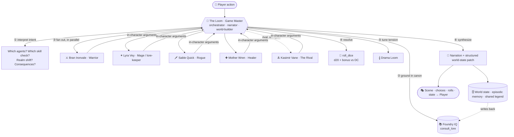

<div align="center">

# 🌑 RIFTWOVEN
### The Shattered Moon of Eldervale

**A multi-agent fantasy RPG where every companion is a reasoning AI agent, an AI Game Master weaves the world turn by turn, and the entire reality can tear between two mirrored worlds — *Split Fiction*–style.**

[](https://polite-cliff-075282b0f.7.azurestaticapps.net)
&nbsp;
[](https://github.com/microsoft/Agents-League-AISF-Regulations)


*“Two were made of one. Everything since has been the world trying to remember which half it was.”*
— inscription on the Moonlit Gate, legible only in a mirror

</div>

---

## 📑 Table of Contents

- [Overview](#-overview)
- [Problem Statement](#-problem-statement)
- [Solution](#-solution)
- [Live Demo & Video](#-live-demo--video)
- [Key Features](#-key-features)
- [Multi-Agent Architecture](#-multi-agent-architecture)
- [How the Reasoning Works (a single turn)](#-how-the-reasoning-works-a-single-turn)
- [The Azure AI Stack](#-the-azure-ai-stack)
- [The *Split Fiction* Realm Mechanic](#-the-split-fiction-realm-mechanic)
- [The World of Eldervale](#-the-world-of-eldervale)
- [Tech & Design Decisions](#-tech--design-decisions)
- [Getting Started](#-getting-started)
- [Configuration (Live Azure Mode)](#-configuration-live-azure-mode)
- [Model Context Protocol (MCP) Server](#-model-context-protocol-mcp-server)
- [Project Structure](#-project-structure)
- [Hackathon Requirements — Coverage Matrix](#-hackathon-requirements--coverage-matrix)
- [Evaluation](#-evaluation)
- [Roadmap](#-roadmap)
- [Credits & License](#-credits--license)

---

## 🌌 Overview

**RIFTWOVEN — The Shattered Moon of Eldervale** is a fully playable, browser-based multi-agent role-playing game built for the **Microsoft Agents League** hackathon (**Reasoning Agents** track, **Challenge B**).

You create a hero, and you are immediately bound to your **mirror-self** — your literal inverse, born when the moon **Eldra** shattered and every reflection stepped out of the glass. Together and estranged, you cross the **two faces of a broken world** toward the **Starwell**, the wellspring that can mend the moon, finish breaking it, or weave two halves into something new.

Underneath the story is the real point of the project: **a transparent, reasoning, multi-agent system you can watch think.** An AI **Game Master** ("The Loom") orchestrates a council of in-character companion agents every turn — interpreting your intent, grounding itself in canon, fanning out to the agents, rolling the dice, and re-weaving the scene — and the game **shows you its entire chain of reasoning, live, on every turn.**

It is a single, self-contained `index.html` that runs **offline with a scripted Loom** (so a live demo can never fail on stage) and **upgrades transparently to a full live Azure AI stack** — chat, vision, video, voice, and retrieval — with no change to the visible orchestration.

---

## 🎯 Problem Statement

Most "AI agent" demos share three failures that this project set out to fix:

1. **The reasoning is invisible.** You see an output, but not *why* — which agent argued what, what knowledge was retrieved, how the decision was reached. For a track literally named **Reasoning Agents**, the reasoning has to be the product, not a hidden implementation detail.
2. **They are brittle.** A single API hiccup, a content-filter false-positive on fantasy prose, or no network at all, and the demo dies. Live-on-stage reliability is treated as an afterthought.
3. **They are single-model and shallow.** One LLM call dressed up as "an agent." A genuinely *agentic* system reasons across **multiple specialized agents and multiple AI modalities** (language, vision, audio, retrieval) and **maintains state, memory, and consequence** over a long interaction.

**Challenge:** build a reasoning-agent experience that is *legible* (you can watch it think), *resilient* (it never hard-fails), and *genuinely multi-agent and multi-modal* (many cooperating agents across many Azure AI services), wrapped in something a person actually wants to keep using.

---

## ✨ Solution

RIFTWOVEN answers each of those directly:

| Problem | How RIFTWOVEN solves it |
|---|---|
| **Invisible reasoning** | Every turn renders **“The Loom's Reasoning”** — an auto-expanded, numbered chain: ① interpret intent → ② ground in canon (Foundry IQ) → ③ each council agent's argument → ④ dice resolution → ⑤ drama tuning → ⑥ narration, stamped with the live model latency. A **⚡ LIVE AI** HUD lights up each Azure model the instant it fires. |
| **Brittleness** | A fully scripted offline "Loom" runs the **identical** orchestration with zero network, so the demo is stage-proof. Live mode layers on top. Server-side relays auto-soften + retry on content-filter trips, with graceful in-world fallbacks at every layer. |
| **Shallow single-model** | A real **Game-Master-orchestrated council of agents** plus **five Azure AI modalities** — language (gpt-4.1 function-calling), vision (gpt-image-1), film (sora-2), voice (gpt-realtime + Azure Speech), and grounded knowledge (Foundry IQ / Azure AI Search) — all wired into one turn loop with persistent world state, episodic memory, and a shared cross-player legend. |

The result is a game that is also a **live, watchable demonstration of an Azure reasoning-agent architecture.**

---

## 🎬 Live Demo & Video

| | |
|---|---|
| **▶ Play it now** | **https://polite-cliff-075282b0f.7.azurestaticapps.net** — runs live Azure AI for everyone (no keys needed; a hosted "Community Loom" holds them server-side with daily caps). |
| **🎥 Demo video** | [`riftwoven-demo-2min.mp4`](./riftwoven-demo-2min.mp4) — a 2-minute walkthrough of a full turn, the realm-tear, and the live reasoning trace. |
| **💻 Run locally** | Open [`index.html`](./index.html) in any modern browser. No build, no server, no dependencies. |

> The public site is the same `index.html` deployed to **Azure Static Web Apps**, with managed Functions (`/api/*`) acting as a keyless relay so visitors get the real models without ever seeing a key.

---

## 🚀 Key Features

- **🧠 Multi-agent Game Master loop** — "The Loom" interprets intent, routes to character agents, resolves dice, narrates, and patches world state every turn.
- **👁 Visible reasoning on every turn** — the auto-expanded **Loom's Reasoning** chain + the live **Agents** telemetry tab show the full orchestration: GM → tool calls → agent fan-out → dice → synthesis, with per-call source (Azure vs. local) and latency.
- **⚡ LIVE AI HUD** — a top bar where 🧠 gpt-4.1, 🎨 gpt-image-1, 🎬 sora-2, 🗣 Azure Speech, and 📚 Foundry IQ each pulse in real time the moment they run, so it's unmistakable the game is live AI.
- **🪞 *Split Fiction* realm-tear** — tear the veil and the entire world, UI, companions' gear, magic, soundtrack, and map morph between two mirrored realms with a screen-tearing transition (a human-in-the-loop confirmation gates this irreversible act).
- **🎨 Generated art** — gpt-image-1 paints character portraits, enemy face key-art, and a hand-painted two-faced **atlas** for the world map (both mirror-faces fused at the rift).
- **🎬 Cinematic visions** — sora-2 renders a short film at each new **chapter** and a filter-safe **death cinematic** when your hero falls.
- **🗣 Voice** — Azure neural TTS narrates the world; **Commune** mode opens a live voice-to-voice conversation with the Loom over WebRTC (gpt-realtime).
- **📚 Grounded knowledge (Foundry IQ)** — agents call `consult_lore` against an Azure AI Search index of the campaign canon to stay consistent; per-saga **episodic memory** and a shared cross-player **World Legend** are written back into the index.
- **🌳 Diablo-style level-up & skill trees** — chapter/level-gated progression with four discipline branches + a realm-and-class-specific tree, capstones, and stat allocation.
- **📖 Event-gated chapters** — a *Lord of the Rings*–style act structure that advances on story events and milestones, not just turn counts.
- **⚔ Dice, factions, quests, map** — d20 skill checks with success/partial/failure, three factions on reputation bars, dynamic quest generation, and a 7-node two-faced location graph.
- **🔌 MCP server** — exposes the game's tools (`consult_lore`, `roll_dice`, `narrate_turn`, `get_canon`) over JSON-RPC so *external* agents can play.
- **🛡 Stage-proof** — full offline simulation of the identical flow; nothing on stage depends on the network.

---

## 🧩 Multi-Agent Architecture

Every turn is a real orchestration fan-out, not a single prompt. The Game Master is the reasoning hub; the companions are specialized agents; tools ground and resolve.



### The Council

| Agent | Role | Reasoning specialty |
|---|---|---|
| **The Loom** | Game Master / orchestrator | Interprets intent, decides routing & checks, grounds in lore, resolves, narrates, patches state. Tool-using, multi-round function-calling. |
| **Bran Ironvale** | Warrior | Frontline tactics, protection, threat assessment. |
| **Lyra Vey** | Mage / lore-keeper | Arcane reasoning; **calls `consult_lore`** to keep the world consistent. |
| **Sable Quick** | Rogue | Scouting, risk, trickery, the unconventional option. |
| **Mother Wren** | Healer | Support and the party's moral compass; can call tools. |
| **Kasimir Vane** | **The Rival** | A recurring character agent — ally, antagonist, or the saga's most expensive lesson, set by your trust. Rendered **separately** from the loyal party. |
| **The Unmirrored King** | Ultimate antagonist | The being born without a reflection, shattering the mirror; revealed through sora-2 cinematics and gpt-image-1 key-art. |

---

## 🔬 How the Reasoning Works (a single turn)

The thing the Reasoning-Agents track is judged on is the loudest thing on screen. Each turn the Loom executes — and **renders** — this chain:

| Step | What happens | Made visible as |
|---|---|---|
| **① Interpret** | gpt-4.1 reads the player's free-text action and decides intent, which agents matter, and what skill check (if any) applies. | `∴ interpret` row |
| **② Ground** | The Loom calls `consult_lore` against **Foundry IQ** to retrieve relevant canon so it never contradicts the world. | `📚 ground · Foundry IQ` rows with the query + hits |
| **③ Council** | Relevant companion agents respond **in character, in parallel**, arguing for their approach. | `◈ agent · <name>` rows in each agent's color |
| **④ Dice** | A d20 skill check resolves the action: `d20 + bonus vs DC → success / partial / failure`. | `🎲 dice` row with the full roll |
| **⑤ Drama** | A "Drama Loom" nudges difficulty to keep tension meaningful, and explains why. | `𝄞 drama loom` row |
| **⑥ Narrate** | gpt-4.1 synthesizes everything into prose and emits a **structured state patch** (HP, flags, inventory affinity, faction, new objectives). | `✒ narrate` row + the scene |

All six render inside **🧠 THE LOOM'S REASONING**, auto-expanded, numbered, and stamped **⚡ gpt-4.1 · \<ms\>** when the turn ran live (or *offline simulation* when scripted). The full per-call log — Azure vs. local, latency, decisions — lives in the **Agents** telemetry tab.

> **Same flow, both modes.** Offline, the Loom *simulates* the identical six-step orchestration (including a Foundry IQ retrieval) so the architecture is fully visible and demo-proof. Live, the same call sites perform real Azure function-calling across multi-round tool loops. The UI is identical — you can flip between them mid-game.

---

## 🛠 The Azure AI Stack

RIFTWOVEN is genuinely multi-modal — **five** Azure AI capabilities cooperate inside one turn loop.

| Capability | Azure service / model | What it does in the game |
|---|---|---|
| **Reasoning core** | **Azure OpenAI — gpt-4.1** (function-calling, JSON mode, SSE streaming) | The Game Master and lore-keeper agents: interpret, route, resolve, narrate, patch state. |
| **Vision** | **Azure OpenAI — gpt-image-1** | Character portraits, enemy face key-art, the two-faced painted **atlas** map, and the Unmirrored King. |
| **Film** | **Azure OpenAI — sora-2** (video job API) | Chapter-opening cinematics and the death cinematic — short generated films, ~30–50s per clip. |
| **Voice** | **Azure OpenAI — gpt-realtime** (WebRTC) + **Azure AI Speech** (neural TTS) | "Commune" live voice-to-voice with the Loom; neural narration of the world. |
| **Grounded knowledge** | **Foundry IQ — Azure AI Search** (`eldervale-lore` index) | `consult_lore` retrieval over the canon; per-saga **episodic memory** + a shared **World Legend** (every player's deeds) written back as documents. |
| **Hosting & relay** | **Azure Static Web Apps** + managed **Functions** (`/api/*`) | Serves the app and acts as a **keyless relay** (daily caps) so the public site is live AI for everyone. |
| **Safety tuning** | Custom **Responsible AI** content-filter policy | A `riftwoven-permissive` policy (blocks only High severity) applied to gpt-4.1 and gpt-image-1 so fantasy violence isn't false-flagged; relays still soften + retry as defense-in-depth. |

---

## 🪞 The *Split Fiction* Realm Mechanic

The world exists **twice**. Tear the veil and everything morphs to the mirror realm — theme, UI palette, companion gear, the magic system, the soundtrack's key, and the map's painted face — with a screen-tearing transition. Tearing the veil is **irreversible in the moment**, so it's gated by a **human-in-the-loop confirmation**.

The six realms form **three twinned pairs**:

| Realm | Genre | ⇄ | Mirror | Genre |
|---|---|:--:|---|---|
| **Arcanum** ✶ | Arcane Fantasy | ⇄ | **The Spire** ⚡ | Neon Sci-Fi |
| **The Mire** ⚔ | Grim Medieval | ⇄ | **The Cogwarren** ⚙ | Clockwork Steam |
| **Aetherium** ✷ | Cosmic Void | ⇄ | **Emberfall** ☄ | Ashen Ruin |

The same location reads differently in each face — a ruined chapel in one is a sealed data-vault in the other — and the **map** can fuse both faces into a single painted atlas meeting at the rift.

---

## 🗺 The World of Eldervale

> Ninety years ago the moon **Eldra** — never stone, but a vast mirror the world used to look at itself — **was broken.** Every reflection tore loose from its original. The sky has held two drifting half-moons since, joined by a hairline scar of light the commonfolk call **the Seam**.

You and your **mirror-self** must cross the twinned worlds to the **Starwell** — raw possibility, the ink before the story — pursued by **Kasimir Vane** (a man who killed his own reflection and means to write it back) and by the **Unmirrored King** (born without a reflection, and shattering the mirror so no one else will have one either). The Starwell answers to *intent*: the saga's three endings are versions of one question — **what do you do with a broken thing?**

The full campaign bible — cosmology, timeline, factions, character secrets, and endings — is in [`STORY.md`](./STORY.md).

---

## ⚙ Tech & Design Decisions

- **Single self-contained `index.html` (~600 KB).** All HTML, CSS, and JS inline. No build step, no framework, no dependencies — open it and it runs. This was a deliberate choice for **stage reliability** and reviewer friendliness.
- **Offline-first, live-upgradable.** A scripted "Loom" runs the identical orchestration with zero network; live Azure mode layers on the same call sites. The demo cannot hard-fail.
- **Keyless public play.** Keys never live in the deployed file. They sit in **SWA app settings**, behind managed Function relays (`/api/llm`, `/api/img`, `/api/lore`, `/api/tts`, `/api/rtc`, `/api/mcp`) with per-day caps. Local power users can supply their own keys via an opt-in `#setup=` config that is stored only in `localStorage`.
- **Resilience baked in.** Server-side content-filter soften + single short retry; client-side in-world fallbacks; a bounded, priority image-generation queue so cinematic art jumps the line without stampeding the deployment.
- **Responsive.** A viewport-locked 3-column layout on desktop, a 2-column layout on iPad portrait, and a stacked flow on phones.

---

## 🏁 Getting Started

### Play instantly (no setup)

Open **https://polite-cliff-075282b0f.7.azurestaticapps.net** — it's live Azure AI out of the box.

### Run locally (offline)

```bash
# clone, then just open the file — there is no build step
git clone <your-repo-url>
cd eldervale-rift-demo
# open index.html in any modern browser (double-click, or:)
#   Windows:  start index.html
#   macOS:    open index.html
#   Linux:    xdg-open index.html
```

It runs the full game offline with the scripted Loom. Everything — the agent fan-out, the reasoning trace, the realm-tear, dice, factions, the map — works with no network.

---

## 🔧 Configuration (Live Azure Mode)

> **Security:** no key is ever committed or embedded in `index.html`. The public deployment relays through Azure Functions whose app settings hold the keys server-side. For local live mode, the app stores your config only in `localStorage`.

To run live AI locally you provide your own Azure resources:

| Setting | Resource |
|---|---|
| Azure OpenAI endpoint + key | An Azure OpenAI resource |
| Chat deployment | a **gpt-4.1** deployment (function-calling) |
| Image deployment *(optional)* | a **gpt-image-1** deployment |
| Video deployment *(optional)* | a **sora-2** deployment |
| Realtime deployment *(optional)* | a **gpt-realtime** deployment |
| Speech key + region *(optional)* | Azure AI **Speech** |
| Search endpoint + key + index *(optional)* | Azure AI **Search** (Foundry IQ) over the `STORY.md` corpus |

Open **⚙ Azure** in the app and paste them in, or open the site with a `#setup=<base64 config>` link. The visible orchestration is identical to offline mode — you can toggle between them.

---

## 🔌 Model Context Protocol (MCP) Server

RIFTWOVEN doesn't just *use* tools — it **exposes** them. The `/api/mcp` endpoint is a JSON-RPC **MCP server** so an external agent can play the game:

| Tool | Purpose |
|---|---|
| `consult_lore` | Retrieve campaign canon from Foundry IQ |
| `roll_dice` | Resolve a d20 skill check |
| `narrate_turn` | Drive a full Game-Master turn |
| `get_canon` | Fetch a specific canon entry |

This makes the project both an agent *application* and an agent *service*.

---

## 📁 Project Structure

```
eldervale-rift-demo/
├── index.html                # the entire game — HTML + CSS + JS, self-contained
├── api/                       # Azure Static Web Apps managed Functions (keyless relays + MCP)
│   ├── llm/                   #   gpt-4.1 chat relay (soften + retry on content-filter)
│   ├── img/                   #   gpt-image-1 image relay (daily-capped)
│   ├── lore/                  #   Foundry IQ / Azure AI Search retrieval + World Legend
│   ├── tts/                   #   Azure Speech neural TTS
│   ├── rtc/                   #   gpt-realtime WebRTC session broker (Commune)
│   ├── memory/                #   episodic memory writeback
│   └── mcp/                   #   JSON-RPC MCP server (consult_lore, roll_dice, …)
├── STORY.md                   # the full campaign story bible
├── CHANGELOG.md               # detailed version history
├── staticwebapp.config.json   # SWA routing / config
├── riftwoven-demo-2min.mp4    # 2-minute demo video
└── README.md
```

---

## ✅ Hackathon Requirements — Coverage Matrix

| Requirement | In this build |
|---|---|
| **Game Master agent** (orchestrator + narrator + world-builder) | "The Loom" — a tool-using orchestrator that interprets, grounds, routes, resolves, narrates, and patches world state. |
| **5 character agents** (Warrior / Mage / Rogue / Healer / Rival) | Persona'd agents with dual-mirror gear; lore-keepers (Mage, Healer, Rival) call tools themselves. |
| **Foundry IQ — campaign lore** | `consult_lore` retrieval over an Azure AI Search index (`eldervale-lore`) of the `STORY.md` canon, with graceful fallback to a built-in index. |
| **Code Interpreter — checks** | d20 dice / skill-check engine, logged as a tool call. |
| **Web Search — public-domain inspiration** | `web_search` tool over a public-domain folklore corpus. |
| **Storage / MCP — world state** | Shared campaign state (flags, party, quest, equipment, XP) via structured GM patches + a real JSON-RPC MCP server. |
| **Telemetry dashboard** | **Agents** tab — live architecture legend, per-turn orchestration flow, and full agent/tool call log; plus the auto-expanded reasoning trace and LIVE AI HUD. |
| **Human-in-the-loop** | Confirmation gate before irreversible acts (tearing the veil). |
| **Map / location graph** | 🗺 a 7-node, two-faced location graph; names re-read per mirror-face; fused painted atlas in split mode. |
| **Dynamic quest generation** | ✦ Leads generator (200+ combos) + live GM `new_objective` patches pursued for XP + reputation. |
| **Faction reputation** | Three factions (Moon-tenders / Quiet Hand / Severed Court) on −100…+100 bars with Hostile→Allied bands. |
| **Evaluation set** | ✓ Eval — automated checks for rule correctness & story consistency (passing). |
| **Multi-modal AI** | gpt-4.1 + gpt-image-1 + sora-2 + gpt-realtime + Azure Speech + Foundry IQ, all in one loop. |
| **Live + offline parity** | The same multi-agent flow runs in both; live mode does real Azure function-calling, offline simulates it. |

---

## 🧪 Evaluation

The **✓ Eval** button runs an in-app automated suite checking rule correctness (dice math, DC bands, state patches) and story/world consistency (lore grounding, realm-coherent naming, faction math). The suite passes; results render in-app so a reviewer can verify the system behaves, not just that it renders.

---

## 🗺 Roadmap

- Swap the three live call sites (`gmInterpretLive`, `agentSpeak`, `gmNarrateLive`) for **Azure AI Foundry Agent Service** connected agents — the UI does not change.
- Persist the **World Legend** as a permanent cross-player canon that future sagas retrieve.
- Expand the MCP server toolset so external agents get the full turn surface.
- Additional twinned realms and chapter cinematics.

---

## 📜 Credits & License

Built by **Jeff Lynch** for the **Microsoft Agents League** hackathon (Reasoning Agents track, Challenge B).

Powered by **Azure OpenAI** (gpt-4.1, gpt-image-1, sora-2, gpt-realtime), **Azure AI Speech**, **Azure AI Search / Foundry IQ**, and **Azure Static Web Apps**.

Licensed under the **MIT License** — see [`LICENSE`](./LICENSE).

<div align="center">

*“Stories tell their tellers. The Loom narrates the world — but it is dying, and it is listening.”*

**▶ [Play RIFTWOVEN](https://polite-cliff-075282b0f.7.azurestaticapps.net)**

</div>
